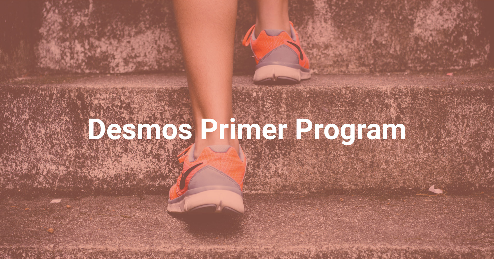

## Introduction
Community participation is crucial to the success of a new project. This is why we are launching *Desmos Primer* ("*Primer*"), a simple cookbook that will help you to get started with Desmos and enjoy a brand new social networking experience. 

## How the Primer works
To make things as easy as possible we will gradually publish new challenges that, once completed, will grant you `Desmos Tokens`. To help newer users to get used to the blockchain space, along with each challenge we will publish a step-by-step completion guide to explain the reason behind some specific operations. 

Please note that you will only get Desmos Tokens when you have completed the challenges by the given deadlines and conditions.

In case of dispute, Desmos’ team reserves the right of the final decision.

## Registering for the Primer
In order to participate to the Primer you need to have an active GitHub account to help us identify you uniquely. If you do not have one yet, you can register for free here: [Join GitHub](https://github.com/join).

## Phases
If you're feeling ready to take part to the Primer, here are all the phases currently active:  

- [Phase 1](phase-1/README.md)
- [Phase 2](phase-2/README.md)
- [Phase 3](phase-3/README.md)
- [Phase 4](phase-4/README.md)
- [Phase 5](phase-5/README.md)
